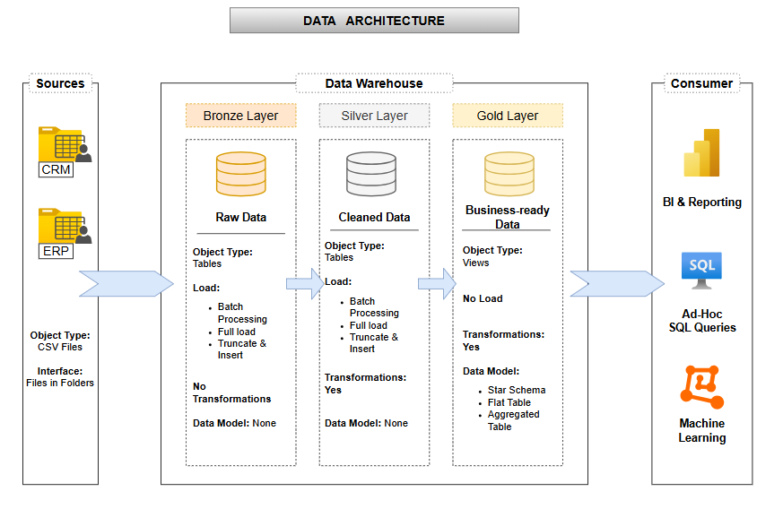

# SQL-Data-Warehouse-Project ✨

Welcome to the **Data Warehouse Project** repository ! 🚀
This project demonstrates a comprehensive and analytics solution, from building a data warehouse to generating actionable insights.
Designed to highlight industry level best practices in data engineering and analytics.

---

## 🚀 Project Requirements:

### Building the Data Warehouse (Data Engineering)
#### Objective:
Develop a modern data warehouse using postgreSQL to consolidate sales data, enabling analytical reporting and informed decision-making.

#### Specifications:
- **Data Sources**: Import data from two source systems (ERP & CRM) provided as CSV files.
- **Data Quality**: Cleanse and resolve data quality issues prior to analysis.
- **Integration**: Combine both sources into a single, user-friendly data model, designed for analytical queries.
- **Scope**: Focus on the latest dataset only; historization of data is not required.
- **Documentation**: Provide clear documentation of the model to support both business stakeholders and analytics teams.

### Data Architecture:

---

## 🙋‍♀️ About Me:
Hi, I am **Prachi Vaidya**, a  **Data Analyst** who is trying to enter into data analytics field and passionate about learning continuosly.

---

### **Thank You !** for coming here. Let's connect and grow together...🐱‍🏍
